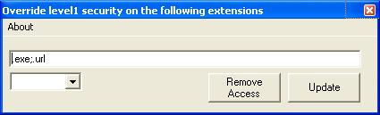



## MSOutlook XP Reg

### Description

Microsoft Outlook XP (2002) does not allow you to receive certain attachments in your emails and there is no way to change this in ANY of the program settings. I know that Microsoft is only trying to protect the users from malicious emails but, as an advanced and careful user of Outlook, I would like to be able to screen my own emails. After some research, I found a registry entry that will enable the blocked extensions. All this simple code does is make it easy for you to add these registry entries. Some votes and comments on this would be nice because even though this is very simple, it is useful.
 
### More Info
 

             |
---                |---
**Submitted On**   |2003-11-27 09:06:02
**By**             |[Eugene Wolff](https://github.com/Planet-Source-Code/PSCIndex/blob/master/ByAuthor/eugene-wolff.md)
**Level**          |Intermediate
**User Rating**    |4.8 (19 globes from 4 users)
**Compatibility**  |VB 6\.0
**Category**       |[Complete Applications](https://github.com/Planet-Source-Code/PSCIndex/blob/master/ByCategory/complete-applications__1-27.md)
**World**          |[Visual Basic](https://github.com/Planet-Source-Code/PSCIndex/blob/master/ByWorld/visual-basic.md)
**Archive File**   |[MSOutlook\_1696331182004\.zip](https://github.com/Planet-Source-Code/eugene-wolff-msoutlook-xp-reg__1-51095/archive/master.zip)

